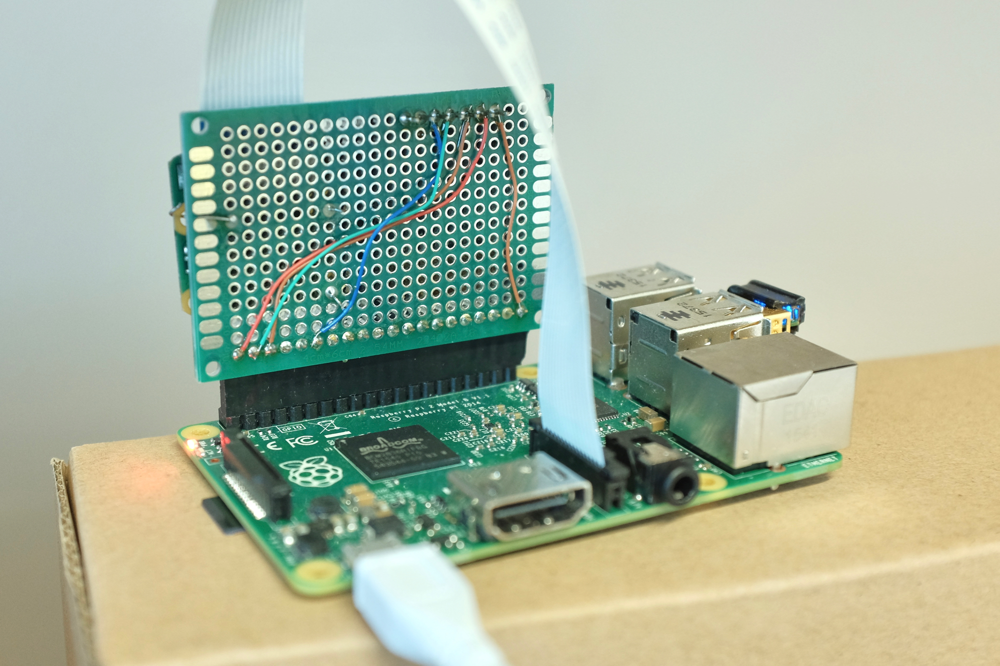

# facepunch: A facial recognition punch clock

facepunch tracks how many hours you spend in front of your desk.

The concept is rather simple: the picamera takes a photo every 15 seconds, if my face is found, current time is recorded.

The logged time then added up to calculate my exact working hours every week. The result is displayed on an OLED screen.

## What you need

* [Raspberry Pi Model B](https://www.raspberrypi.org/products/raspberry-pi-3-model-b/). It might work on [Zero](https://www.raspberrypi.org/products/raspberry-pi-zero-w/) too but I haven't tested it myself.
* [Raspberry Pi Camera Module](https://www.raspberrypi.org/products/camera-module-v2/)
* **OPTIONAL** [128x64 1.3 inch OLED display](https://www.adafruit.com/product/938), search "1.3 oled" on ebay and alibaba for much cheaper ones. 0.96 inch OLED also works.

OLED is optional, skip related steps if you're not using one.

## Get it working

### Set up Raspberry pi

[Install the latest Raspbian here](https://www.raspberrypi.org/documentation/installation/installing-images/)

### Wire up OLED display and camera

[OLED install guide](https://learn.adafruit.com/ssd1306-oled-displays-with-raspberry-pi-and-beaglebone-black/wiring)

[Camera install guide](https://projects.raspberrypi.org/en/projects/getting-started-with-picamera)

I placed the camera and OLED together on a perf board that plug into the header, of course you can put them somewhere else or design your own PCB.

### Install required libraries

[luma OLED library](https://luma-oled.readthedocs.io/en/latest/install.html), install for python3.

[face_recognition library](https://gist.github.com/ageitgey/1ac8dbe8572f3f533df6269dab35df65)

There is a typo in the above instruction, at the step `Download and install dlib v19.6:`

change 

`sudo python3 setup.py install --compiler-flags "-mpfu=neon"` 

to

`sudo python3 setup.py install --compiler-flags "-mfpu=neon"`

Note how the `-mfpu` flag was misspelled.

### Provide your photo

The program needs a picture of your face in order to learn what you look like. Get a picture of your well-lit face in a clean background and name it `me.jpg` and place it in the software folder. The resolution should be around 400x400 otherwise the processing time is going to be long. An example is already provided so just replace it with your own.

### Run the program

Run `python3 detect.py` to start face detection and logging.

Run `python3 display_oled.py` to display time statistics on the OLED.

Or if not using an OLED, run `python3 display_text.py` to print the statistics to the terminal.

You might have to play with `camera.rotation` and `camera.brightness` at the beginning of `detect.py` depending on how your camera is oriented and your lighting condition. You can open up `image.jpg` to see the latest photo taken.

Default OLED reset pin is 17, change it to what you use in `display_oled.py`.

## Limitations

* All timestamps are in UTC. I'm in UK so this isn't a issue, but you can play with python datetime timezones if it bothers you.

* It only keeps track of a single face since I made it for myself. However it's trivially easy to change it to [recognize multiple faces](https://github.com/ageitgey/face_recognition/blob/master/examples/recognize_faces_in_pictures.py).
